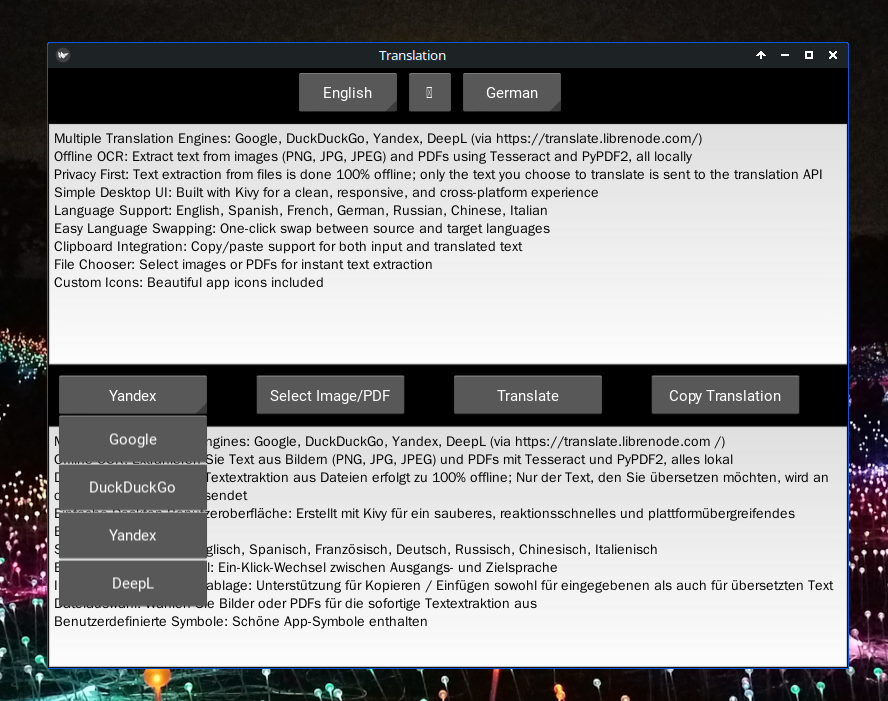
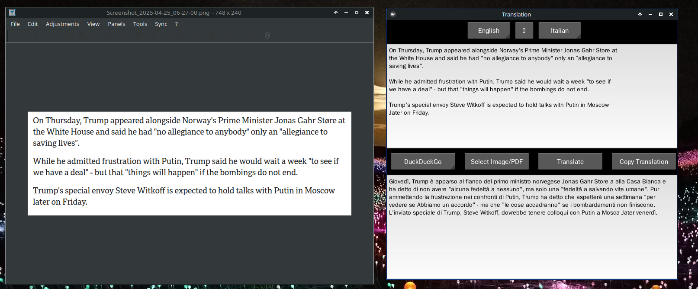
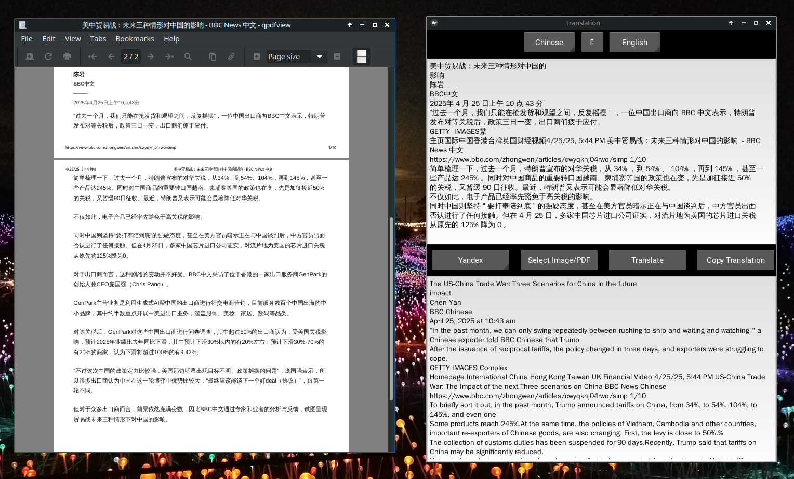

# dotranslate

A powerful, privacy-friendly desktop translation app with offline OCR and file support, powered by the LibreNode translation API.

## Features

- **Multiple Translation Engines**: Google, DuckDuckGo, Yandex, DeepL (via https://translate.librenode.com/)
- **Offline OCR**: Extract text from images (PNG, JPG, JPEG) and PDFs using Tesseract and PyPDF2, all locally
- **Privacy First**: Text extraction from files is done 100% offline; only the text you choose to translate is sent to the translation API
- **Simple Desktop UI**: Built with Kivy for a clean, responsive, and cross-platform experience
- **Language Support**: English, Spanish, French, German, Russian, Chinese, Italian
- **Easy Language Swapping**: One-click swap between source and target languages
- **Clipboard Integration**: Copy/paste support for both input and translated text
- **File Chooser**: Select images or PDFs for instant text extraction
- **Custom Icons**: Beautiful app icons included
  
## Screenshots



  

## Installation

### 1. Build and Install the Standalone Executable (Recommended)
This is the easiest and most user-friendly way to install dotranslate. It will build the app, install it to `/opt/translator`, and add it to your applications menu.

```bash
sudo ./install_and_build.sh
```

After installation, you can launch dotranslate from your applications menu or by running:
```bash
/opt/translator/translator
```

---

### 2. (Optional) Run with Python (No Build)
If you prefer to run the app directly with Python (for development or troubleshooting):

```bash
git clone https://github.com/theresepot/dotranslate.git
cd dotranslate
python3 -m venv venv
source venv/bin/activate
pip install -r requirements.txt
python translator.py
```

---

## Windows Installation

### 1. Install Python
- Download Python 3.8 or newer from the [official Python website](https://www.python.org/downloads/windows/).
- During installation, **check the box that says "Add Python to PATH"**.
- Complete the installation.

### 2. Install Tesseract OCR
- Download the Tesseract installer for Windows from the [official Tesseract releases page](https://github.com/tesseract-ocr/tesseract/wiki#windows).
- Run the installer and follow the prompts.
- **Remember the install location** (e.g., `C:\Program Files\Tesseract-OCR`).

#### Add Tesseract to your PATH (Automated):
- Run the provided `add_tesseract_to_path.bat` script as administrator (right-click → "Run as administrator").
- If you installed Tesseract in a different location, edit the script and change the path at the top.
- You may need to restart your terminal or computer for the change to take effect.

 ... or ...

#### Add Tesseract to your PATH (Manual):
- Open the Start menu, search for "Environment Variables", and open "Edit the system environment variables".
- Click "Environment Variables..."
- Under "System variables", find and select the `Path` variable, then click "Edit..."
- Click "New" and add the path to your Tesseract install folder (e.g., `C:\Program Files\Tesseract-OCR`)
- Click OK to close all dialogs.

### 3. Install Git (optional, but recommended)
- Download Git for Windows from [git-scm.com](https://git-scm.com/download/win) and install it.

### 4. Download dotranslate
#### Option 1: Using Git
```sh
git clone https://github.com/theresepot/dotranslate.git
cd dotranslate
```
#### Option 2: Download ZIP
- Go to your GitHub repo page.
- Click the green "Code" button, then "Download ZIP".
- Extract the ZIP file and open the extracted folder.

### 5. Create and Activate a Virtual Environment
```sh
python -m venv venv
venv\Scripts\activate
```

### 6. Install Python Dependencies
```sh
pip install -r requirements.txt
```

### 7. Run the App
```sh
python translator.py
```

### 8. (Optional) Build a Standalone Executable
If you want a Windows `.exe`:
```sh
pyinstaller --onefile --windowed translator.py
```
The `.exe` will appear in the `dist` folder.

#### Tesseract Language Packs
By default, Tesseract on Windows comes with English. For other languages (Chinese, Russian, etc.), download the `.traineddata` files from [here](https://github.com/tesseract-ocr/tessdata) and place them in your `tessdata` folder (e.g., `C:\Program Files\Tesseract-OCR\tessdata`).

#### Troubleshooting

- If you get an error about Tesseract not found, double-check your PATH and that Tesseract is installed.
- If you get a missing DLL error, make sure you installed the correct (64-bit or 32-bit) version of Python and Tesseract for your system.

---

## Why Use dotranslate?
- **Works with images and PDFs**: Extract text from files locally, even when offline
- **No vendor lock-in**: Choose your preferred translation engine
- **Privacy-respecting**: Only the text you want to translate is sent to the API; file contents never leave your computer
- **Cross-platform**: Works on Linux, Windows, and macOS (with minor adjustments)
- **Open source**: Free to use, modify, and share


## Contributing
Pull requests and suggestions are welcome!

## License
MIT License

---

### Credits
- [LibreNode Translate API](https://translate.librenode.com/)
- [Kivy](https://kivy.org/)
- [Tesseract OCR](https://github.com/tesseract-ocr/tesseract)
- [PyPDF2](https://pypdf2.readthedocs.io/)

---

**dotranslate**: The easiest way to translate anything, from anywhere, with privacy and power. 
